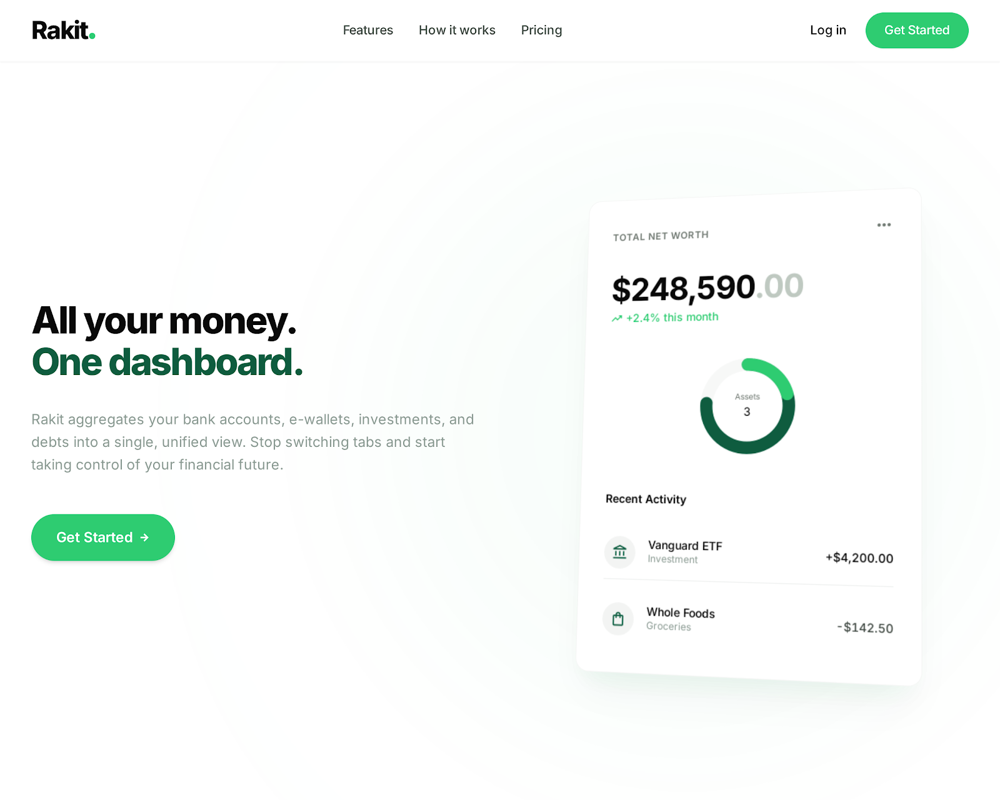
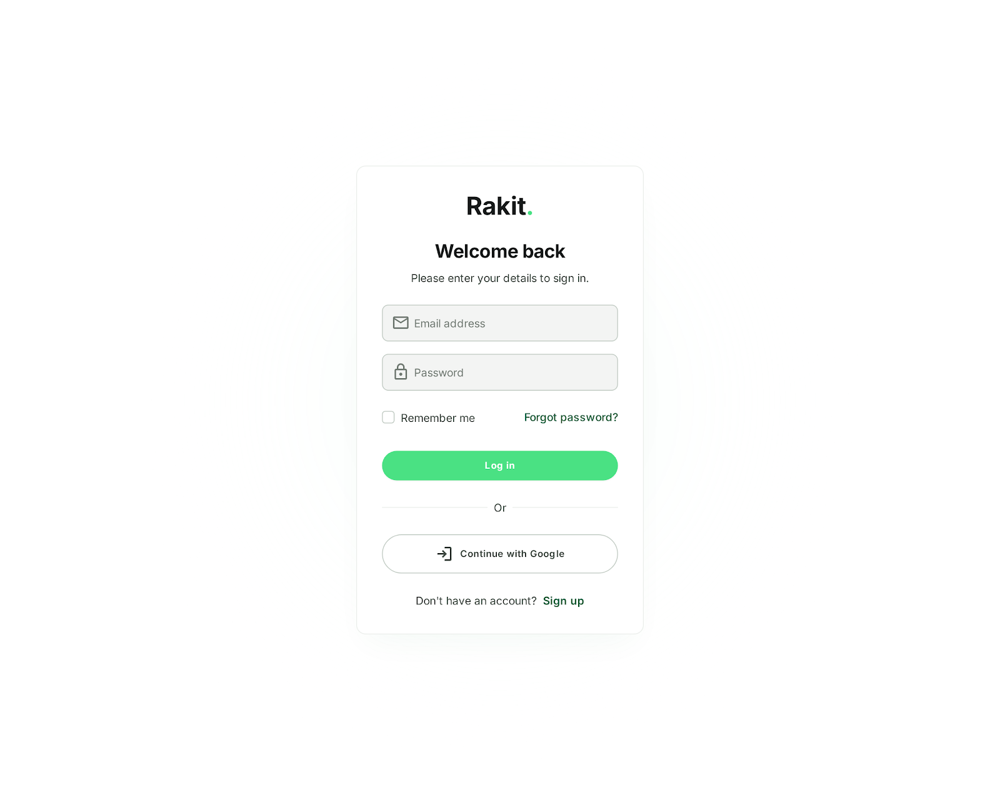
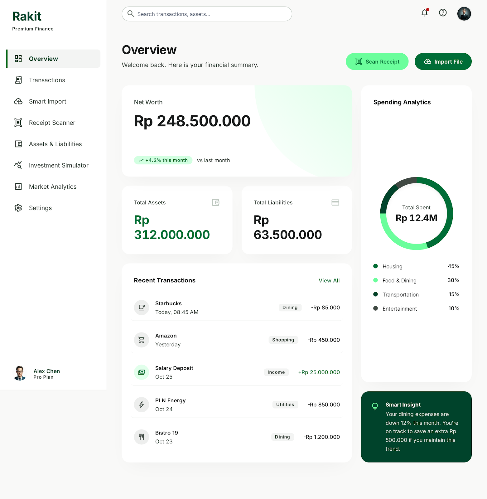
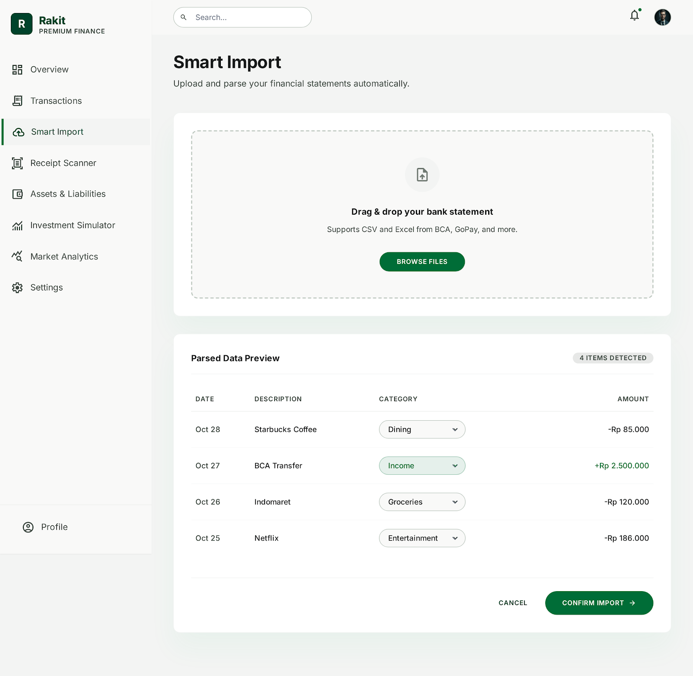
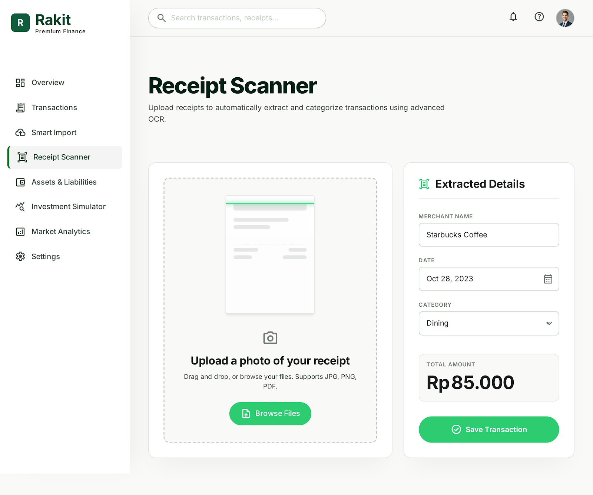
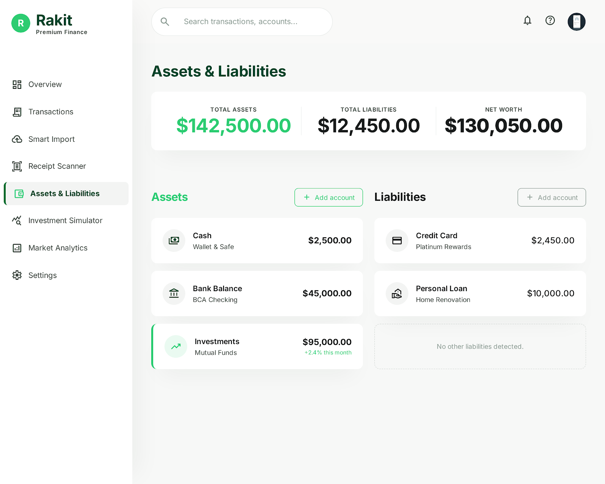
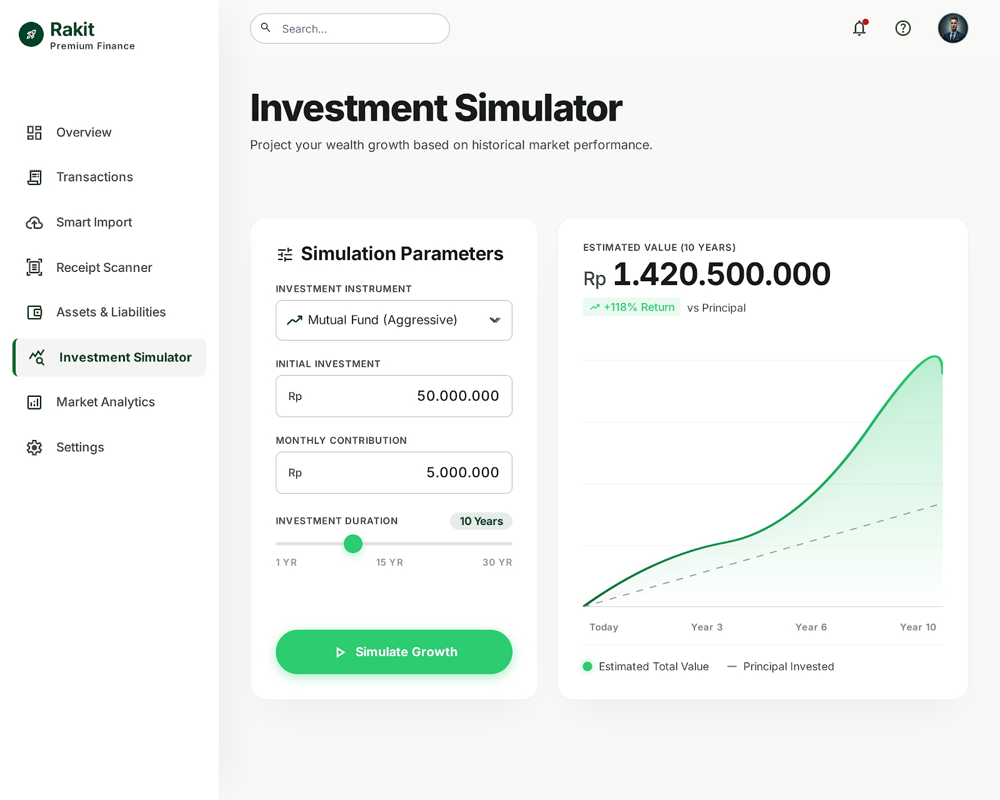
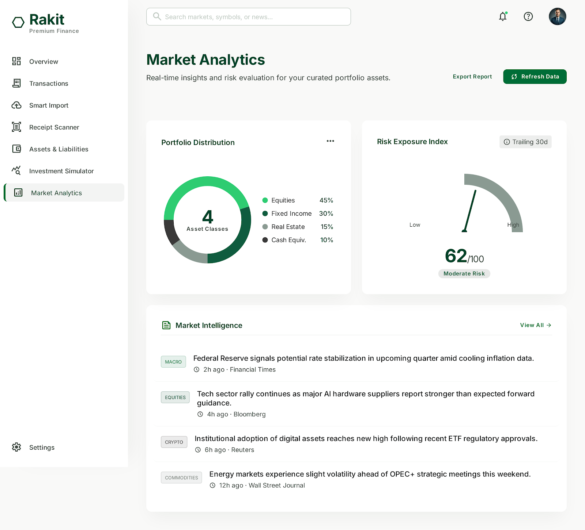

# Rakit Finance

Rakit is a premium-feeling personal finance dashboard built as a Flask-rendered PWA. It includes authentication, transactions, Smart Import, OCR receipt scanning, asset/liability tracking, an investment simulator, market analytics, and demo data.

## Screenshots

### Landing Page



### Login



### Dashboard Overview



### Smart Import



### Receipt Scanner



### Assets and Liabilities



### Investment Simulator



### Market Analytics



## Setup

```powershell
python -m venv .venv
.venv\Scripts\Activate.ps1
pip install -r requirements.txt
flask --app app.py init-db
flask --app app.py seed-demo
python app.py
```

Open `http://127.0.0.1:5000`, then log in with:

```text
demo@rakit.local
password
```

OCR requires the Tesseract executable to be installed on the machine. If it is unavailable, the receipt scanner falls back to editable manual confirmation.

## OOP Requirements

The inheritance and polymorphism requirements are implemented directly in the backend:

- `app/models/account.py`: `Account` is an abstract SQLAlchemy base with `AssetAccount` and `LiabilityAccount`. `transfer()` works through the shared account interface.
- `app/parsers/transaction_parser.py`: `TransactionParser` is abstract. `BcaParser` and `GopayParser` both override `parse()`, and `ImportService` calls them polymorphically.
- `app/models/investment.py`: `InvestmentAsset` is abstract. `MutualFundAsset`, `GoldAsset`, and `CryptoAsset` override `calculate_projection()`.

## UI Notes

The implementation uses the provided `UI/` references as the visual source: white/off-white surfaces, emerald actions, compact premium cards, Material Symbols, dashboard shell, drag/drop import, receipt confirmation, charts, and investment controls.

Frontend rendering stays in Flask/Jinja with Tailwind CDN, vanilla JS, GSAP, Anime.js, and Chart.js. React Bits-style effects are recreated in `app/static/js/react-bits-effects.js` without React.

## Structure

```text
app/
  models/
  parsers/
  services/
  routes/
  templates/
  static/
```

The app includes `manifest.json` and a service worker stub so it can be installed as a basic PWA.
